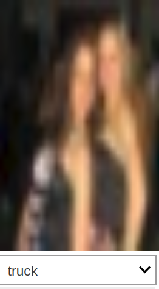

# dataset-cleaner
Notebook with instructions to clean your dataset in with interactive widgets in Jupyter Notebook.

This project consists of a dataset cleaner in Jupyter Notebook with the following functionalities:

- **Image Relabeler and Deleter:** suggests mislabeled images and gives the user the option to relabel them (by [Zach Caceres](http://zachcaceres.com/now/) with help from Jason Patnick) or directly delete them from the dataset.

Let's see an example in CIFAR. This doesn't look like a truck does it? Relabel/delete away!

- **Image Duplicate Deleter:** suggests potential duplicates in the dataset and gives the user the option to delete them (by Francisco Ingham)

Let's see a few examples in CIFAR. Found a duplicate? Delete away!

Just be careful that the images you are deleting are actual duplicates and not augmented images like this one:

How much difference can be considered a duplicate? That's a good question and the decision is yours. If one image is augmented many times and the other ones are not, then the model will disproportionately weigh that image against the others and that is not what you want (you don't want the model to favor one type of frog because it saw 5 images of it vs 1 image of the other types). However, augmentation generally is a good thing, since it enriches the dataset and reduces overfitting. Conclusion: if you can have augmentation without excessively augmenting one image over others, then keep it! Otherwise you should delete some of the oversampled examples.
